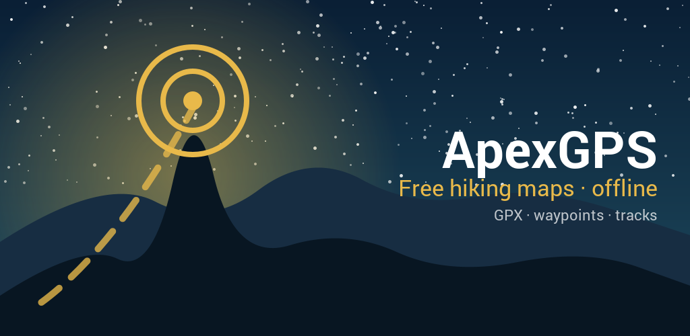
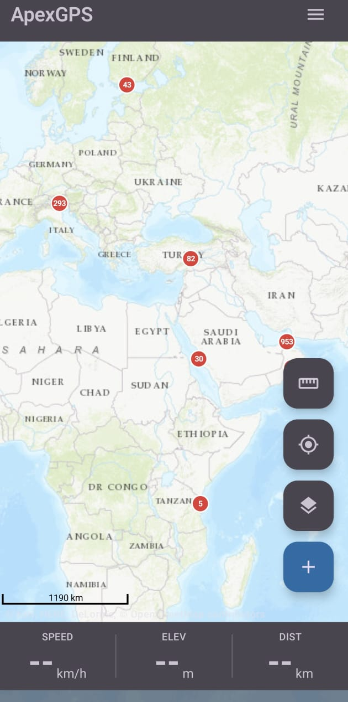
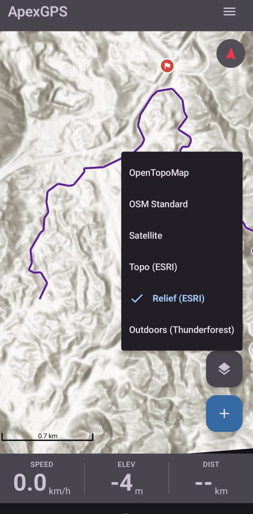
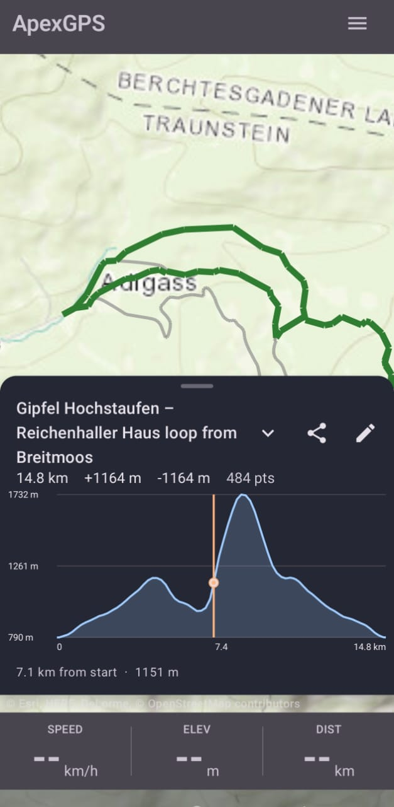
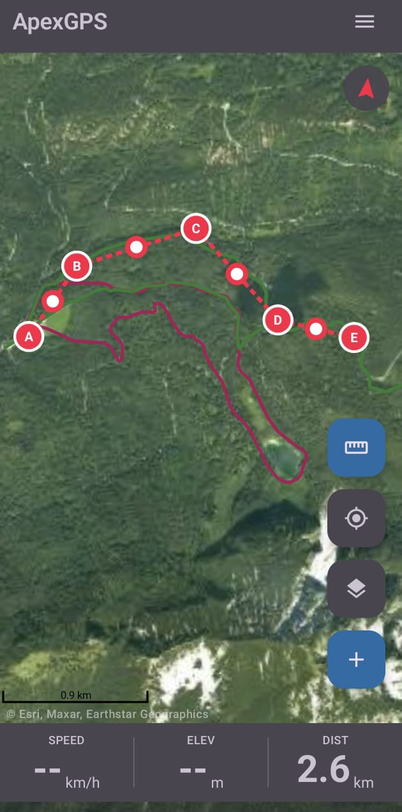
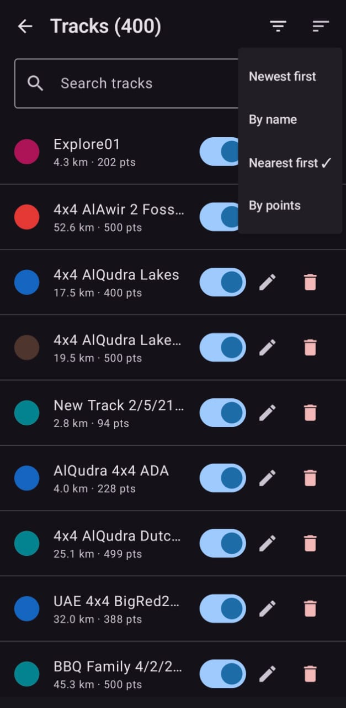

# ApexGPS

**Free Android hiking app · 100% offline · No subscription · No tracking**

[**▶ Visit the website**](https://apexgps.duttra.de/) &nbsp;·&nbsp;
[**📖 User guide**](https://apexgps.duttra.de/docs/) &nbsp;·&nbsp;
[**📱 Request access**](mailto:sandwalker.one@proton.me?subject=ApexGPS%20access%20request) &nbsp;·&nbsp;
[**🔒 Privacy**](https://apexgps.duttra.de/privacy.html)

---

## See it in action

---

## What's inside

|  |  |  |
|---|---|---|
| 🗺️ **Six map providers**   OpenTopoMap, OSM, ESRI Topo & Relief, Satellite, Outdoors | 📥 **Offline regions**   Download tiles by area before you head out | 📍 **GPX import & export**   Open standard — bring tracks from anywhere |
| ⛰️ **Elevation profiles**   From your recording or fetched from terrain DEM | 🛰️ **Live GPS recording**   Foreground tracking, survives screen-off & reboots | ✏️ **Track planner**   Sketch a route by tapping the map; save as a real track |
| ☁️ **Hiking-grade weather**   Per-waypoint hourly forecasts, no API key | 🧭 **Compass & navigation**   Bearing & distance to any waypoint | 💾 **Backup & restore**   One-tap ZIP of every track, waypoint, region |

---

## Why ApexGPS?

- **No subscription** — every feature, free, forever.
- **No tracking** — your location stays on your device. We don't run servers.
- **Open formats** — GPX in, GPX out. Your data stays portable.
- **Six languages** — English · Deutsch · Français · Español · Polski · العربية.
- **Lean** — < 4 MB APK, runs on Android 8+.
- **Honest** — closed-testing alpha while it earns its production launch.

---

## Documentation

| English | Deutsch | Français | Español | Polski | العربية |
|---|---|---|---|---|---|
| [**Read**](https://apexgps.duttra.de/docs/) | [**Lesen**](https://apexgps.duttra.de/de/docs/) | [**Lire**](https://apexgps.duttra.de/fr/docs/) | [**Leer**](https://apexgps.duttra.de/es/docs/) | [**Czytaj**](https://apexgps.duttra.de/pl/docs/) | [**اقرأ**](https://apexgps.duttra.de/ar/docs/) |

This repository hosts the public website source for [`apexgps.duttra.de`](https://apexgps.duttra.de/). The Android app source itself is private (closed-testing alpha).

## Contact

[sandwalker.one@proton.me](mailto:sandwalker.one@proton.me)
